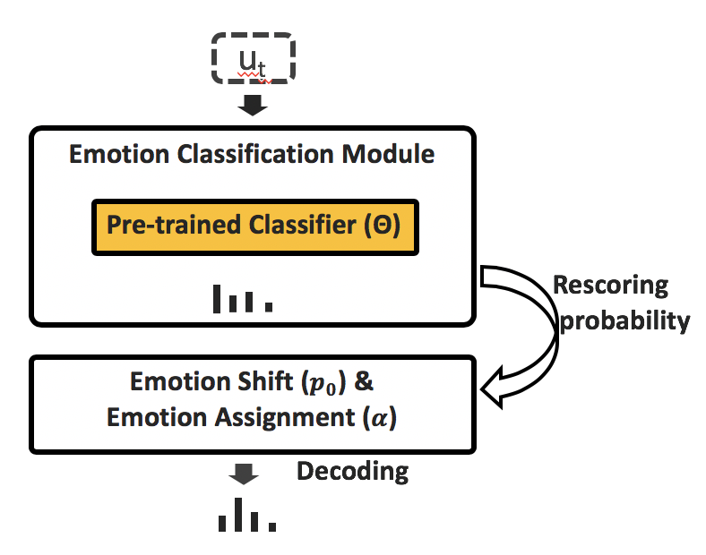

# Dialogical Emotion Decoding

This is an implementation of Dialogical Emotion Decoder presented in this year ICASSP 2020. In this repo, we use IEMOCAP as an example to 
evaluate the effectiveness of DED.

## Overview
	
<p align="center">
  
</p>


## Note
+ The performance is **better** than shown in the paper because I found a little bug in recoring part.
+ To test on your own emotion classifier, replace `data/outputs.pkl` with your own outputs.
	+ Dict, {utt_id: logit}

## Arguments
The definitions of the args are described in `ded/arguments.py`. You can modify all args there.

## Usage

```bash
python3 main.py --verbosity 1 --result_file RESULT_FILE
```


## Results
Results of DED with beam size = 5.

| Model |  UAR  |  ACC  | 
|:-----:|:-----:|:-----:|
| Pretrained Classifier | 0.671  | 0.653  |
| DED | 0.710  | 0.695  |
