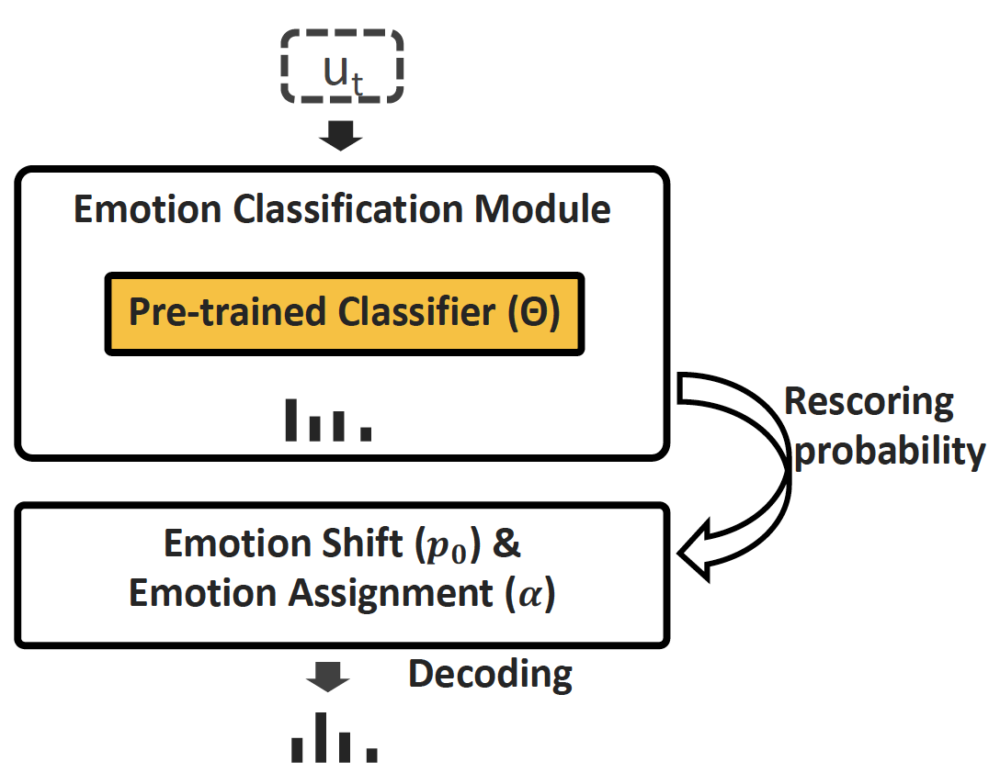
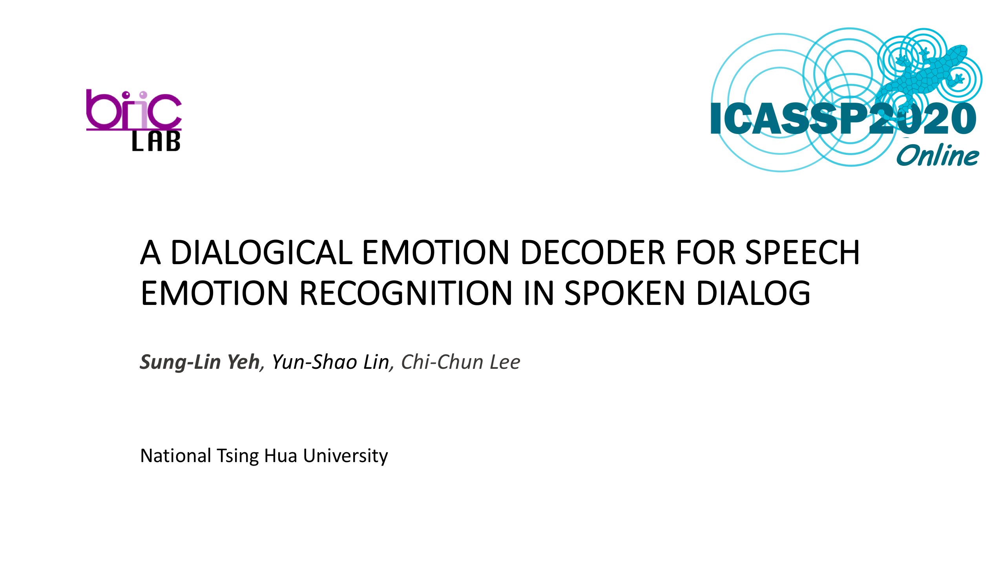

# Dialogical Emotion Decoding

This is an implementation of Dialogical Emotion Decoder presented in this year ICASSP 2020. In this repo, we use IEMOCAP as an example to 
evaluate the effectiveness of DED.

## Overview
	
<p align="center">
  
</p>


## Note
+ The performance is **better** than shown in the paper because I found a little bug in the rescoring part.
+ To test on your own emotion classifier, replace `data/outputs.pkl` with your own outputs.
	+ Dict, {utt_id: logit} where utt_id is the utterance name in [IEMOCAP](https://sail.usc.edu/iemocap/release_form.php).

## Requirements

```bash
pip3 install virtualenv
virtualenv --python=python3 venv
source venv/bin/activate
pip3 install -r requirements.txt
```

## Dataset

Currently this repo only supports [IEMOCAP](https://sail.usc.edu/iemocap/release_form.php).

## Arguments

The definitions of the args are described in `ded/arguments.py`. You can modify all args there.

## Usage

```bash
python3 main.py --verbosity 1 --result_file RESULT_FILE
```


## Results
Results of DED with beam size = 5.

| Model |  UAR  |  ACC  | 
|:-----:|:-----:|:-----:|
| Pretrained Classifier | 0.671  | 0.653  |
| DED | 0.710  | 0.695  |

## Oral Presentation
[](https://www.youtube.com/watch?v=Ti4foNyrvzo)
